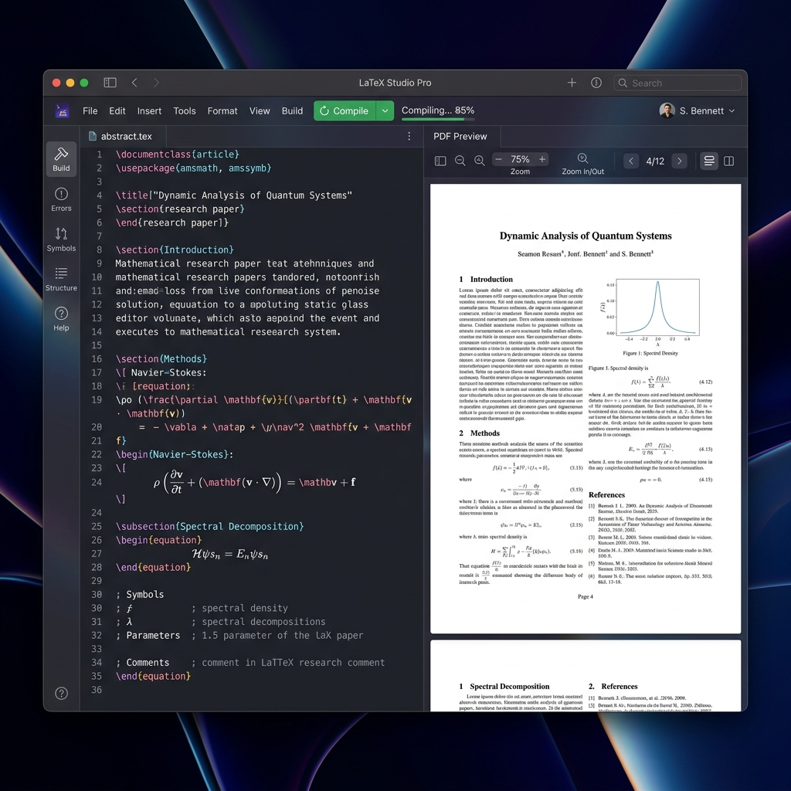

<div align="center">
  
  <h1>LaTeX Studio Pro</h1>
  <p><strong>A professional, modern, and beautiful LaTeX research environment built for productivity.</strong></p>

  

  <p>
    <a href="#features">Features</a> •
    <a href="#installation">Installation</a> •
    <a href="#build-from-source">Build</a> •
    <a href="#tech-stack">Tech Stack</a>
  </p>
</div>

---

## 🚀 Overview

**LaTeX Studio Pro** is a standalone desktop application and web-based research platform tailored for writing, editing, and compiling LaTeX documents. It merges the power of the Monaco Editor with a premium, glassmorphism-inspired UI and native system compilation to deliver an unparalleled authoring experience.

Whether you are writing academic papers, research journals, or complex mathematical documents, LaTeX Studio Pro provides all the necessary tools to streamline your workflow.

## ✨ Features

- **Robust Code Editing**: Integrated Monaco Editor featuring advanced LaTeX syntax highlighting, code completion, and essential keyboard shortcuts (`Ctrl+S` to save, `Ctrl+Enter` to compile).
- **Multi-Project Management**: Easily create, organize, and manage multiple LaTeX projects within a unified workspace.
- **Live PDF Preview**: Seamlessly view your compiled documents side-by-side with your code. The PDF viewer automatically refreshes upon successful compilation.
- **Premium User Interface**: A modern aesthetic with deep dark mode, glassmorphism elements, resizable panels, and subtle micro-animations.
- **Native Compilation**: Leverages your system's `pdflatex` to securely and efficiently compile documents directly on your machine.
- **Export & Backup**: Export your entire project or individual files as a `.zip` archive with a single click.

## 📦 Installation

### Pre-built Packages (Linux)
You can easily install the application using the pre-compiled Debian package (`.deb`). 

1. Download the `.deb` file from the **Releases** page of this repository.
2. Install it using the following command in your terminal:
   ```bash
   sudo dpkg -i latex-studio-pro_1.0.0_amd64.deb
   sudo apt-get install -f # To resolve any missing dependencies
   ```
3. Launch **LaTeX Studio Pro** directly from your system application menu!

> **Note:** A local LaTeX compiler is required. See the Prerequisites below.

## 🛠️ Build from Source

To build and run the application locally from source, ensure you have **Node.js** (v20+) installed.

### 1. Prerequisites
You must have a LaTeX compiler installed on your system. For Ubuntu/Debian based systems:
```bash
sudo apt update && sudo apt install -y texlive-latex-base texlive-fonts-recommended texlive-latex-extra latexmk
```

### 2. Running in Development Mode
This project is split into a React frontend and an Express backend.

**Start the Backend:**
```bash
cd backend
npm install
node server.js
```
*The backend will run on `http://localhost:3001`.*

**Start the Frontend:**
```bash
cd frontend
npm install
npm run dev
```
*The frontend will run on `http://localhost:5173`.*

### 3. Packaging the Desktop App (Electron)
To build the standalone `.deb` installer yourself:
```bash
./build_premium.sh
```
This script will build the frontend, package the Electron backend, and output the final `.deb` installer inside the `electron-app/dist/` folder.

## 💻 Tech Stack

- **Frontend**: React 18, Vite, TypeScript, Vanilla CSS (Premium Glassmorphism UI)
- **Editor**: Monaco Editor (VS Code core)
- **Backend**: Node.js, Express (handles file I/O and compilation commands)
- **Desktop App**: Electron, electron-builder
- **Compilation Engine**: Local System `pdflatex`

## 🤝 Contributing
Contributions, issues, and feature requests are welcome! Feel free to check the issues page.

## 📄 License
This project is licensed under the MIT License.
